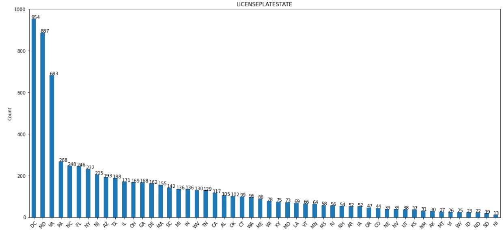

# Fatality Prediction for Car Crash

Sheldon Sebastian

---------------


# Abstract

The costs of fatalities and injuries due to traffic accidents have a great impact on the society. This project explores the deaths caused by car accidents in the DC area. Car crash dataset was analyzed and it was found that the target FATAL class has severe imbalance. To predict the fatality caused by car accidents predictive models such as Logistic Regression, Decision Tree, Random Forest, XGBoost and ensemble of best models were used for classification. The performance of models are compared and feature importance for each model is performed.

*Keywords*: Binary Classification, Class Imbalance, Logistic Regression, Decision Tree, Random Forest, XGBoost, Ensembling

## Table of Contents:

- Introduction
    - Business Usecase
    - Dataset Description
    
    
- Workflow 


- Folder Structure


- Data Preprocessing
    - Data Cleaning
    - Exploratory Data Analysis
    - Stratified Train-Validation-Test Splits
    - Handling Missing Data
    - Encoding Categorical Columns
    - Separating Feature and Target
    
    
- Modeling 
    - Evaluation Metric
    - Dummy Classifier
    - Logistic Regression
    - Decision Tree
    - Random Forest
    - XGBoost
    - Model Ensemble
    
    
- Performance Comparison


- Model Feature Importance


- Conclusion


- References

------------------

# 1. Introduction

Road traffic crashes are one of the world's largest public health and injury prevention problems. The problem is all the more acute because the victims are overwhelmingly healthy before their crashes. This project focuses on predicting fatalities or deaths caused by car crash accidents in DC. If we can predict the person's risk of fatality based on input features we can provide high priority emergency services. This will reduce death rate and save the person's life.


### Business Usecase:

This project can help emergency agencies and services to dispatch proper response based on risk of fatality for individuals in car crash. 

### Dataset Description:

To achieve the task of predicting fatality for user in car crash the dataset was downloaded from Metropolitan Police Department's Crash Data Management System. It can be accessed [here](https://opendata.dc.gov/datasets/70248b73c20f46b0a5ee895fc91d6222/data)

*Data dictionary:*

| Column Name       | Description     | Notes     | 
| :------------- | :----------: | -----------: |
|  OBJECTID | Unique Identifier to the dataset   |     |
|  CRIMEID  | Foreign key to external dataset |  |
|  CCN  | Foreign key to external dataset |  |
|  PERSONID  | Unique Identifier for person |  |
|  PERSONTYPE  | Type of participant | Possible values are: Passenger, Driver, Pedestrian, Bicyclist  |
|  AGE  | Age of participants | Numeric column |
|  MAJORINJURY  | Participant suffered Major Injuries  | Yes-No |
|  MINORINJURY  | Participant suffered Minor Injuries | Yes-No |
|  VEHICLEID  | Unique Identifier for vehicle |  |
|  INVEHICLETYPE  | Type of vehicle  | Passenger car, large truck, taxi, government, bicycle, pedestrian, etc |
|  TICKETISSUED  | If persons issued a ticket | Yes-No |
|  LICENSEPLATESTATE  | If a vehicle, the state (jurisdiction) license plate was issued (not license plate number) | 50 States |
|  IMPAIRED  | Are any persons deemed ‘impaired’ | Yes-No |
|  SPEEDING  | Was person in vehicle where speeding was indicated | Yes-No |
|  **FATAL**  | Fatality of the person involved in car crash | This is the **TARGET** variable and is binary. Yes-No |


-----------------

# 2. WorkFlow

The following tasks were performed in this project:


-----------------

# 3. Folder Structure

The following diagram describe the folder structure:


The **model_trainer** folder contains the following folders:


---------------------

# 4. Data Preprocessing

### Data Cleaning:

The detailed process of data preprocessing and cleaning notebook can be accessed [here](https://github.com/sheldonsebastian/GW-Data-Science-Datathon/blob/main/0_preprocessing_eda.ipynb)

The original dataset had **596381 rows. The distribution of FATAL column:: N: 595964, Y: 417**

The following data cleaning steps were performed:
1. Drop irrelevant unique identifier columns such as OBJECTID, CRIMEID, CCN, PERSONID, VEHICLEID
2. Column Consolidation: 
- INVEHICLETYPE colummn: It originally had **21 levels** with varying frequency. They were combined to get **9 levels** as follows: 
    
        ['Passenger Car',  'Other Vehicle',  'Suv (sport Utility Vehicle)',  'Large/heavy Truck',  'Cargo Van',  'Other Small/light Truck', 'Bus', '2 wheeler',  'Pickup Truck']
    
    
- AGE column: The numeric age column was converted into categorical with the following levels: 
    
        [0-17, 18-20, 21-30, 31-40, 41-50, 51-60, 61-70, 71-80, 81-90]

3. After converting all columns to categorical the **duplicate rows were dropped**. 

After cleaning, the dataset had **8181 rows. The distribution of FATAL column:: N: 8008, Y: 173**

### Exploratory Data Analysis

The detailed code of the EDA can be found [here.](https://github.com/sheldonsebastian/GW-Data-Science-Datathon/blob/main/0_preprocessing_eda.ipynb) After the data was cleaned the distribution of the features and target column was plotted.

**1. FATAL:**

This is the target column which we are going to predict. As we can see we have a severe class imbalance, where we have only 173 Fatal encounters and 8008 Non-Fatal encounters.


**2. PERSONTYPE:**

The distribution of PERSONTYPE column is shown below. Majority of values are for Driver.


**3. AGE:**

The distribution of AGE column is shown below. Majority of participants are in 21-30 range.


**4. MAJORINJURY:**

The distribution of MAJORINJURY column is shown below.


**5. MINORINJURY:**

The distribution of MINORINJURY column is shown below.


**6. INVEHICLETYPE:**

The distribution of INVEHICLETYPE column is shown below. Majority of cars are passenger car.


**7. TICKETISSUED:**

The distribution of TICKETISSUED column is shown below.


**8. LICENSEPLATESTATE:**

The distribution of LICENSEPLATESTATE column is shown below. Majority of values are DC.


**9. IMPAIRED:**

The distribution of IMPAIRED column is shown below.


**10. SPEEDING:**

The distribution of SPEEDING column is shown below.


### Stratified Train-Validation-Test Split:

The detailed code of the Train-Validation-Test Split can be found [here.](https://github.com/sheldonsebastian/GW-Data-Science-Datathon/blob/main/0_preprocessing_eda.ipynb) The data was split into Train-Validation-Test in a **stratified manner**. 

The scheme for splitting the data is: 
**60% Train - 20% Validation - 20% Test**

### Handling Missing Data

The detailed code of handling missing data can be found [here.](https://github.com/sheldonsebastian/GW-Data-Science-Datathon/blob/main/0_preprocessing_eda.ipynb)

The train-validation-test data had the following percentage of missing data:


The missing data was imputed using the **most_frequent** strategy. The statistics for imputing missing data was computed using training data. This training data statistic was used in validation and testing data.

### Encoding Categorical Columns

The detailed code of encoding categorical data can be found [here.](https://github.com/sheldonsebastian/GW-Data-Science-Datathon/blob/main/0_preprocessing_eda.ipynb). The categorical *feature data* was encoded using *One Hot Encoding* and the *target* data was encoded using *Label Encoder*.

### Separating Feature and Target

After the data was cleaned, split, encoded and imputed the features column and target column were separated for train, validation and test and were stored as pickle files [here](https://github.com/sheldonsebastian/GW-Data-Science-Datathon/tree/main/input_data).


----------------------------

# 5. Modeling

### Evaluation Metric

Since the Target FATAL Class is **extremely imbalanced** we cannot use accuracy to evaluate model. 

For this project False Negatives are costlier than False Positives. 

In this context, *FALSE NEGATIVE* is:

- GT = FATAL
- PRED = NOT FATAL

In this context, *FALSE POSITIVE* is:

- GT = NOT FATAL
- PRED = FATAL

Thus we are using **[F2 score](https://machinelearningmastery.com/fbeta-measure-for-machine-learning/)** for evaluating our models.

### 1. Dummy Classifier

The detailed code for Dummy Classifier can be found [here.](https://github.com/sheldonsebastian/GW-Data-Science-Datathon/blob/main/model_trainer/0_dummy_classifier.ipynb)

Since False Negatives are more costlier than False positives, a dummy classifier will always predict FATAL class. Based on this we get:

| Model       | F2 Score     | Split     | 
| :------------- | :----------: | -----------: |
|  Dummy Classifier | 0.02584   |  Validation   |

**This baseline model has no skill and all predicted models should perform better than this F2 score.**

### 2. Logistic Regression

The detailed code for Logistic Regression can be found [here.](https://github.com/sheldonsebastian/GW-Data-Science-Datathon/blob/main/model_trainer/1_logistic_regression.ipynb)

The following steps were performed for Logistic Regression:
- Perform **Categorical SMOTE** on training data to oversample the minority class. The sampling strategy for SMOTE is **0.05** i.e. for every 1:minor datapoint we will have 20:major data points. This sampling strategy was used to avoid overfitting to the minority class.
- For Logistic Regression **class_weight** was set to balanced to handle the class imbalance.
- Grid Search was performed on multiple parameters to get the best model.
- Best model saved [here](https://github.com/sheldonsebastian/GW-Data-Science-Datathon/tree/main/model_trainer/best_saved_models)
- Hyperparameter runs can be accessed [here](https://github.com/sheldonsebastian/GW-Data-Science-Datathon/tree/main/model_trainer/metric_logs)

The performance of best model on validation data is:

| Model       | F2 Score     | Split     | 
| :------------- | :----------: | -----------: |
|  Logistic Regression | 0.462046   |  Validation   |


### 3. Decision Tree Classifier

The detailed code for Decision Tree Classifier can be found [here.](https://github.com/sheldonsebastian/GW-Data-Science-Datathon/blob/main/model_trainer/2_decision_tree.ipynb)

The following steps were performed for Decision Tree Classifier:
- Perform **Categorical SMOTE** on training data to oversample the minority class. The sampling strategy for SMOTE is **0.05** i.e. for every 1:minor datapoint we will have 20:major data points. This sampling strategy was used to avoid overfitting to the minority class.
- For Decision Tree Classifier **class_weight** was set to balanced to handle the class imbalance.
- Grid Search was performed on multiple parameters to get the best model.
- Best model saved [here](https://github.com/sheldonsebastian/GW-Data-Science-Datathon/tree/main/model_trainer/best_saved_models)
- Hyperparameter runs can be accessed [here](https://github.com/sheldonsebastian/GW-Data-Science-Datathon/tree/main/model_trainer/metric_logs)

The performance of best model on validation data is:

| Model       | F2 Score     | Split     | 
| :------------- | :----------: | -----------: |
|  Decision Tree Classifier |  0.397351  |  Validation   |


### 4. Random Forest Classifier

The detailed code for random forest classifier can be found [here.](https://github.com/sheldonsebastian/GW-Data-Science-Datathon/blob/main/model_trainer/3_random_forest.ipynb)

The following steps were performed for Random Forest Classifier:
- Perform **Categorical SMOTE** on training data to oversample the minority class. The sampling strategy for SMOTE is **0.05** i.e. for every 1:minor datapoint we will have 20:major data points. This sampling strategy was used to avoid overfitting to the minority class.
- For Random Forest Classifier **class_weight** was set to balanced to handle the class imbalance.
- Grid Search was performed on multiple parameters to get the best model.
- Best model saved [here](https://github.com/sheldonsebastian/GW-Data-Science-Datathon/tree/main/model_trainer/best_saved_models)
- Hyperparameter runs can be accessed [here](https://github.com/sheldonsebastian/GW-Data-Science-Datathon/tree/main/model_trainer/metric_logs)

The performance of best model on validation data is:

| Model       | F2 Score     | Split     | 
| :------------- | :----------: | -----------: |
|  Random Forest Classifier |  0.416667  |  Validation   |


### 5. XGBoost

The detailed code for XGBoost can be found [here.](https://github.com/sheldonsebastian/GW-Data-Science-Datathon/blob/main/model_trainer/4_XGBoost.ipynb)

The following steps were performed for XGBoost:
- Perform **Categorical SMOTE** on training data to oversample the minority class. The sampling strategy for SMOTE is **0.05** i.e. for every 1:minor datapoint we will have 20:major data points. This sampling strategy was used to avoid overfitting to the minority class.
- For XGBoost weights were computed using **(major_class//minor_class)** to handle class imbalance.
- Grid Search was performed on multiple parameters to get the best model.
- Best model saved [here](https://github.com/sheldonsebastian/GW-Data-Science-Datathon/tree/main/model_trainer/best_saved_models)
- Hyperparameter runs can be accessed [here](https://github.com/sheldonsebastian/GW-Data-Science-Datathon/tree/main/model_trainer/metric_logs)

The performance of best model on validation data is:

| Model       | F2 Score     | Split     | 
| :------------- | :----------: | -----------: |
|  XGBoost |  0.432277  |  Validation   |


### 6. Model Ensemble

The detailed code for ensembling can be found [here](https://github.com/sheldonsebastian/GW-Data-Science-Datathon/blob/main/model_trainer/5_ensemble.ipynb)

The top 3 models using validation score was selected in **hard voting** manner for ensembling. They include:
1. Logistic regression
2. Random Forest 
3. XGBoost

The performance of best model on validation data is:

| Model       | F2 Score     | Split     | 
| :------------- | :----------: | -----------: |
|  Ensemble |  0.50793  |  Validation   |


-------------------

# 6. Performance Comparison

All trained models were evaluated on Test Dataset and the F2 scores are as follows:

| Model       | F2 Score     | Split     | 
| :------------- | :----------: | -----------: |
|  Dummy Classifier (Baseline) |  0.0265  |  Test   |
|  Logistic Regression |  0.4029  |  Test   |
|  Decision Tree Classifier |  0.3532  |  Test   |
|  Random Forest Classifier |  0.4078  |  Test   |
|  XGBoost Classifier |  0.3743  |  Test   |
|  Ensemble (LR + RFC + XGB) |  0.4302  |  Test   |

The Ensemble model was based on top 3 models with high F2 score for validation dataset. The F2 scores for all models were better than Dummy Classifier.

-------------------

# 7. Model Feature Importance

The detailed code for model feature importance can be found [here](https://github.com/sheldonsebastian/GW-Data-Science-Datathon/blob/main/model_trainer/6_feature_importance.ipynb)

### Logistic Regression:

Feature importance for logistic regression is shown below:


### Decision Tree:

Feature importance for decision tree is shown below:


### Random Forest:

Feature importance for random forest is shown below:


### XGBoost:

Feature importance for XGBoost is shown below:


----------------------

# 8. Conclusion

In conclusion, the best model was hard vote ensemble of Logistic Regression, Random Forest and XGBoost. This can be used to predict the fatality of a person in car accident and deploy emergency services.

**Future Scope:**

Future scope includes exploring feature engineering, adding external datasets, exploring different data sampling strategies to improve the overall performance of models. 

---------------------

# References

- https://nycdatascience.com/blog/student-works/predicting-road-accident-fatality-likelihood/
- https://en.wikipedia.org/wiki/Road_traffic_safety
- https://machinelearningmastery.com/fbeta-measure-for-machine-learning/
- [Utilities](https://github.com/yuxiaohuang/teaching/blob/master/gwu/machine_learning_I/fall_2020/code/utilities/p2_shallow_learning/pmlm_utilities_shallow.ipynb)
- [Regression](https://github.com/yuxiaohuang/teaching/blob/master/gwu/machine_learning_I/fall_2020/code/p2_shallow_learning/p2_c1_data_preprocessing/code_example/regression.ipynb)
- [Classification](https://github.com/yuxiaohuang/teaching/blob/master/gwu/machine_learning_I/fall_2020/code/p2_shallow_learning/p2_c1_data_preprocessing/code_example/classification.ipynb)
- [Tree Models](https://github.com/yuxiaohuang/teaching/blob/master/gwu/machine_learning_I/fall_2020/code/p2_shallow_learning/p2_c2_supervised_learning/p2_c2_s5_tree_based_models/code_example/code_example.ipynb)
- [Logistic Regression](https://github.com/yuxiaohuang/teaching/blob/master/gwu/machine_learning_I/fall_2020/code/p2_shallow_learning/p2_c2_supervised_learning/p2_c2_s3_logistic_regression/case_study/case_study_bcw.ipynb)
- [Imbalanced Classification German Bank](https://machinelearningmastery.com/imbalanced-classification-of-good-and-bad-credit/)


```python

```
